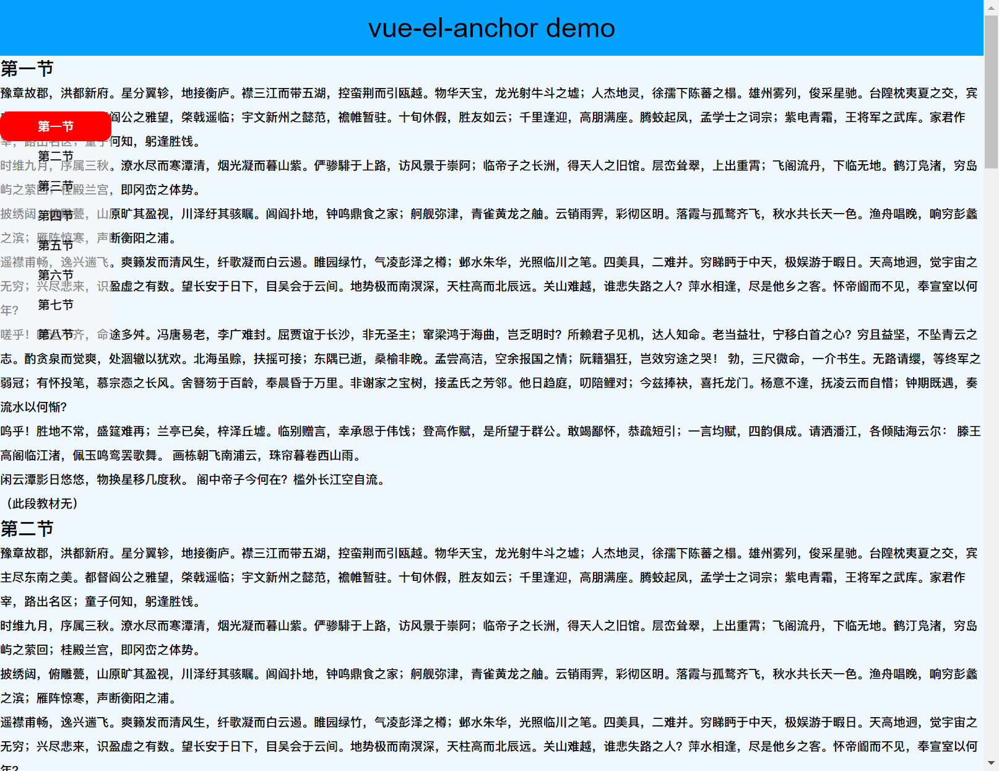

# vue-el-anchor 

## vue 实现实现双向锚点滚动

[查看demo](https://sweetwisdom.github.io/vue-anchor-/demo)




## 主要功能

> - [x] 实现锚点切换功能
>
>   
>
> - [x] 锚点双向切换


## 使用方法

```shell
git clone  https://github.com/sweetwisdom/vue-anchor-.git


<iframe style="width: 100%;height:300px" frameBorder="0" scrolling="no" src="./demo" ></iframe>

```


```vue
<template>
 <anchor :anchorList="data" :position="positonStyle"></anchor>
</template>
<script>
import anchor from "../component/el-anchor/anchor.vue";
export default {
  components: { anchor },
  data() {
    return {
      positonStyle: {
        top: "120px",
        left: "0",
      },
      data: [
        { name: "第一节", id: "1" },
        { name: "第二节", id: "2" },
        { name: "第三节", id: "3" },
        { name: "第四节", id: "4" },
        { name: "第五节", id: "5" },
        { name: "第六节", id: "6" },
        { name: "第七节", id: "7" },
        { name: "第八节", id: "8" },
      ],
    };
  },
  // ...
```

## 配置

```vue
<script>

export default {
props: {
    // 滚动区域的选择器id 默认为window  #container
    container: {
      default: "",
    },
    /**
     * 目录列表
     */
    anchorList: {
      type: Array,
      default: () => {
        return [];
      },
    },
    /**
     * 检测滚动元素的className
     */
    anchorClass: {
      default: "articles",
    },
    /**
     * 定义垂直方向的对齐， "start", "center", "end", 或 "nearest"之一。默认start
     */
    scorllType: {
      default: "block",
    },
    /**
     * 位置 左浮动还是右浮动
     */
    position: {
      default: () => {
        return { top: "60px", right: "0" };
      },
    },
  },
    
}
```

## 核心方法

```js
// 滚动监听的函数
onScroll(e) {
      const navContents = document.querySelectorAll("." + this.anchorClass);

      const offsetTopArr = [];

      navContents.forEach((item) => {
        offsetTopArr.push(item.offsetTop);
      });


      const scrollTop =
        e.target.scrollTop ||
        window.pageYOffset ||
        document.documentElement.scrollTop ||
        document.body.scrollTop; 
    // 滚动条偏移量
      if (!scrollTop) {
        return;
      }

      let navIndex = 0;
      for (let n = 0; n < offsetTopArr.length; n++) {
        if (scrollTop >= offsetTopArr[n]) {
          navIndex = n;
        }
      }

      this.active = navIndex;
    },
  // 跳转到指定锚点
    toToc(a) {
      let as = "#" + a.name;

      document.querySelector(as).scrollIntoView({
        behavior: "smooth", // 平滑过渡
        block: "center",
      });
    },      
  
```

### 效果:

[demo](./demo)
